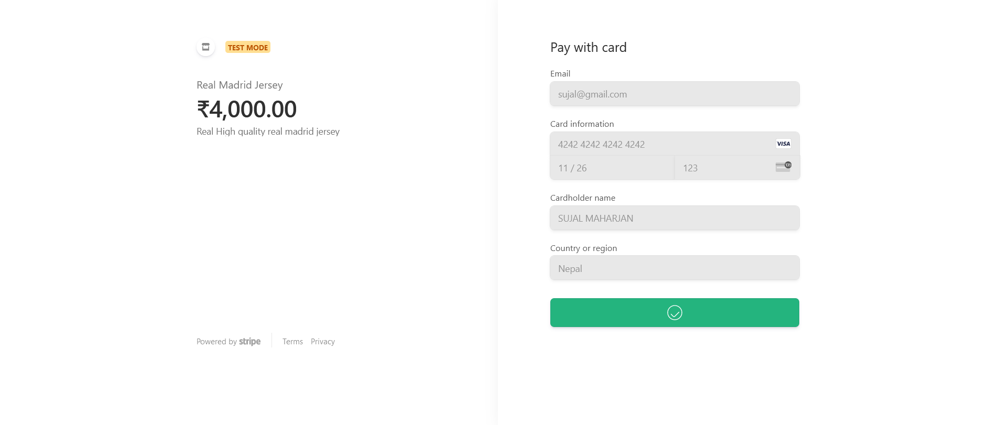

Hello world!

Use below guidelines to run this project
1) git clone https://github.com/SUJAL390/ReactProjectEcommerce.git
2)  change directory and get into project's directory
3)  npm install
4)  npm start

For Admin 
To login as admin we have got admin's credential saved so ,you just have to directly login.
After Login you can get access to both Home Page and Admin Dashboard.

For User
You must create an account if you are a new user before login after creating an account you can login easily.

For Guest
You can browser some products without Login but you cannot make any puchases.

